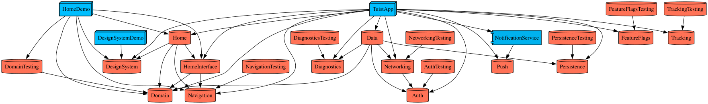

# TuistApp

Tuist 로 모듈화한 iOS 앱 템플릿. iOS 17 이상, Swift 6 언어 모드, Xcode 27.

Claude Code 설정(스킬·훅·빌드 스크립트)은 [.claude/README.md](.claude/README.md)에 따로 정리되어 있다.

## 템플릿으로 새 프로젝트 시작하기

이 저장소로 새 앱을 시작할 때 한 번 따라 하는 절차다. 이미 시작한 프로젝트를 클론한 팀원은
아래 "처음 실행"만 하면 된다.

| 단계 | 하는 일 | 언제 |
| --- | --- | --- |
| 1. 저장소 만들기 | 템플릿 이력을 끊고 새 저장소로 옮긴다 | 시작할 때 |
| 2. 이름 바꾸기 | `Scripts/rename.sh` 로 앱 이름·번들 ID·조직을 바꾼다 | 시작할 때 |
| 3. 돌려 보기 | 도구 설치 → generate → 테스트 통과 확인 | 시작할 때 |
| 4. 첫 커밋과 푸시 | 이름 바꾼 결과를 커밋하고 원격에 올린다. CI 가 바로 돈다 | 시작할 때 |
| 5. 템플릿 샘플 정리 | 샘플 API·화면·키·기록을 앱에 맞게 바꾸거나 지운다 | 첫 기능을 만들 때 |
| 6. 직접 할 일 | Team ID, 번들 ID 등록, Firebase, 푸시, 배포 설정 | 필요해지는 시점마다 |

템플릿은 Team ID·Firebase·서버 주소·배포 시크릿이 모두 비어 있어도 시뮬레이터 빌드·테스트와 CI 가
통과하도록 만들어 두었다. 그래서 6의 항목은 빠뜨려도 당장 드러나지 않는다. 필요해지는 시점에 체크리스트를 본다.

### 준비물

- Xcode 27.x. `Tuist.swift` 의 `compatibleXcodeVersions` 가 27 메이저만 허용해서, 다른 메이저면 `tuist generate` 가 멈춘다.
- [mise](https://mise.jdx.dev). tuist, swiftformat, swiftlint, OpenAPI 생성기의 버전을 `mise.toml` 로 고정한다.
- Homebrew 로 `jq`, `xcbeautify`, `xcode-build-server`. Claude Code 훅·빌드 스크립트와 LSP 가 쓴다.
  모듈 그래프 이미지를 다시 만들려면 `graphviz` 도 필요하다.

### 1. 저장소 만들기

GitHub 에서 "Use this template" 으로 만들면 이력이 끊긴 새 저장소가 생긴다. 클론해서 쓸 때는 템플릿의 커밋
이력과 원격을 버리고 새로 시작한다.

```bash
git clone <템플릿 저장소> MyApp && cd MyApp
rm -rf .git && git init -b main
git add -A && git commit -m "chore: 템플릿에서 시작"
```

`rename.sh` 는 작업 트리가 깨끗해야 돌고 `git ls-files` 로 대상을 찾으므로, 이름을 바꾸기 전에 이 첫 커밋이 필요하다.

### 2. 이름 바꾸기

```bash
Scripts/rename.sh MyApp com.example "Example Inc"
git diff --stat
```

형식은 `Scripts/rename.sh <NewName> <bundlePrefix> [<organizationName>]` 이다.

| 인자 | 규칙 | 예 | 결과 |
| --- | --- | --- | --- |
| `NewName` | 영문자로 시작하는 영숫자 | `MyApp` | 앱 타깃·워크스페이스·스킴 이름, URL 스킴(`myapp://`) |
| `bundlePrefix` | 영숫자·`-` 를 `.` 로 이은 것 | `com.example` | 번들 ID `com.example.myapp`(Debug `.dev`, Staging `.stg`) |
| `organizationName` | 생략하면 그대로 | `"Example Inc"` | 생성 프로젝트의 조직 이름 |

- 옛 값은 `Tuist/ProjectDescriptionHelpers/AppConstants.swift` 에서 읽는다. 그래서 여러 번 실행해도 되고,
  `AppConstants.swift` 의 이름을 손으로 고치면 안 된다(다음 실행이 옛 값을 못 찾는다).
- git 이 추적하는 텍스트 파일 전부에서 옛 앱 이름, URL 스킴, 번들 ID 접두사, 조직 이름을 대소문자를 구분해
  부분 문자열로 치환한다. 헤더 주석, `@testable import`, `.claude/scripts/xcbuild.sh` 의 스킴, `CLAUDE.md` 도 포함된다.
  `docs/plans/`(당시 기록)와 `*.generated.swift` 는 건드리지 않는다.
- 경로에 앱 이름이 들어간 파일(`App/Sources/<앱 이름>App.swift`, `App/Tests/<앱 이름>Tests.swift`,
  `App/UITests/<앱 이름>SmokeUITests.swift`)은 `git mv` 한다.
- 기존 모듈의 타깃 이름(`Home`, `HomeTests`, `AuthDemo` …)이나 시스템 모듈(`SwiftUI`, `Testing` …)과 겹치는 이름은 거절한다.
- 부분 문자열 치환이라, 옛 이름이 흔한 단어면 다른 단어 안의 것도 바뀐다. 결과는 `git diff` 로 검토하고,
  되돌리려면 `git reset --hard` 한다.
- 바꾸지 않는 것: 헤더 주석의 작성자 이름(`Created by …`), Team ID, Firebase 설정, `ClientKeys.xcconfig`,
  Privacy Manifest, 저장소 폴더 이름. 작성자 이름은 `git grep -l 'Created by'` 로 찾아 원하면 직접 바꾼다.

### 3. 돌려 보기

이미 `tuist generate` 해 둔 사본이면 옛 이름으로 만든 워크스페이스와 앱 프로젝트가 남아 있다. 생성물이니 지운다.

```bash
rm -rf *.xcworkspace App/*.xcodeproj
```

그다음 "처음 실행"을 그대로 따라 한다. 마지막의 `./.claude/scripts/xcbuild.sh test` 가 통과하고 Xcode 에서
`<NewName>` 스킴으로 앱이 뜨면 이름 바꾸기가 끝난 것이다.

### 4. 첫 커밋과 푸시

```bash
git add -A && git commit -m "chore: 앱 이름을 MyApp 으로 바꾼다"
git remote add origin <새 저장소> && git push -u origin main
```

푸시하면 `ci.yml` 이 바로 돈다. 시크릿·저장소 변수가 없어도 통과하고, `deploy.yml` 은 시크릿이 없어
`preflight` 만 돌고 배포를 건너뛴다(성공). 이어서 아래 체크리스트의 **GitHub 저장소 설정**을 한다.

Claude Code 의 `PreToolUse` 훅은 Claude 가 `main` 에 직접 커밋하는 것만 막는다. 위 커밋은 사람이 하므로 막히지 않는다.

### 5. 템플릿 샘플 정리

템플릿은 각 레이어의 패턴을 보여 주려고 샘플을 하나씩 넣어 두었다. 급하지 않으니 첫 기능을 만들 때
패턴을 참고한 뒤 앱 것으로 바꾼다.

| 샘플 | 위치 | 할 일 |
| --- | --- | --- |
| 임시 API 명세(`/items`, `/auth/login` …) | `Modules/Core/Networking/OpenAPI/openapi.yaml` | 실제 서버 명세로 바꾸고 `Scripts/openapi-generate.sh` 를 돌려 생성물을 함께 커밋한다. 토큰 없이 부르는 operation 은 `Networking/Sources/Middleware/PublicOperation.swift` 에도 적는다 |
| 서버 주소 | `Configurations/{Debug,Staging,Release}.xcconfig` 의 `API_BASE_URL` | `*.example.com` 을 실제 주소로 바꾼다 |
| 항목 목록 화면(Home) | `Modules/Features/Home`, Domain 의 `Item`·`FetchItemsUseCase`·`ItemRepository`, Data 의 구현 | Route·뷰모델·UseCase·Repository 의 견본이다. 첫 피처를 `Scripts/new-module.sh` 로 만들고 이 흐름을 옮긴 뒤 교체한다 |
| "더보기" 탭 | `App/Sources/Navigation/AppTab.swift` 의 `.more` | 탭 전환을 보여 주는 자리표시자다. 실제 탭으로 바꾼다 |
| 샘플 클라이언트 키(`ANALYTICS_APP_KEY`, `MAP_SDK_KEY`) | `AppConstants.clientKeys`, `Configurations/ClientKeys.xcconfig.example` | 쓰는 키로 바꾸고 안 쓰는 키는 두 곳에서 함께 지운다 |
| 앱 아이콘 | `App/Resources/Assets.xcassets/AppIcon.appiconset` | 비어 있다. 아이콘과 `AccentColor` 를 넣는다 |
| 템플릿 개발 기록 | `docs/plans/*.md` | 템플릿을 만들며 남긴 계획 문서다. 지워도 된다(`.gitkeep` 은 `/ios-plan` 출력 폴더라 남긴다) |
| 모듈 의존 그래프 | `docs/images/module-graph.svg` | 모듈을 바꿀 때마다 `Scripts/module-graph.sh` 로 다시 만든다 |

Home 피처를 통째로 지우는 것보다 첫 피처로 교체하는 편이 쉽다. 앱 곳곳이 Home 을 첫 탭·딥링크 대상으로 쓰기 때문이다.
지운다면 아래를 함께 고치고 `tuist generate` 와 `xcbuild.sh test` 로 확인한다.

- 매니페스트: `App/Project.swift` 의 `dependencies`·`testDependencies`, `Module.swift` 의 `Module.all`·`Module.withDemoApp`
- 조립·이동: `AppContainer+Home.swift`, `AppContainer+Navigation.swift`, `AppRoute.swift`, `AppTab.swift`·`TabRootView.swift`(홈 탭),
  `AppRouter.swift`(시작 탭 `.home`), `DeepLinkParser.swift`
- 테스트: `AppRouteTests`, `AppRouterTests`, `ScopedRouterTests`, `DeepLinkParserTests`, UI 스모크 테스트(`<앱>SmokeUITests`).
  UI 테스트의 고정 항목(`UITestItemRepository`)은 Domain 의 `Item` 을 쓰므로 항목 샘플을 지울 때 함께 바꾼다

### 복제한 뒤 직접 할 일

`rename.sh` 가 하지 않는 일이다. 필요해지는 시점별로 나눴다. 이 목록은 `rename.sh` 의 안내가 가리키는 곳이라
제목을 바꾸지 않는다.

**GitHub 저장소 설정** (첫 푸시 직후)

- [ ] `main` 에서 `develop` 을 만들어 푸시하고, GitHub 기본 브랜치를 `develop` 으로 바꾼다("브랜치와 배포").
      `develop` 없이 쓰려면 그 절의 "`develop` 없이 쓰려면"을 따른다.
- [ ] Settings > Actions > General 에서 "Allow GitHub Actions to create and approve pull requests" 를 켠다.
      꺼져 있으면 `main` 푸시 뒤 역머지 PR 생성(`back-merge.yml`)이 실패한다.
- [ ] Settings > Rules 에서 rulesets 를 만든다.
  - `main`·`develop`: PR 필수, required checks(`lint`, `build-test`, `release-build`, `release-archive`)
  - `main`·`develop`: merge commit 허용(출시 PR 은 `main`, 역머지 PR 은 `develop` 대상이고 둘 다 merge commit 이어야 한다).
    Settings > General 의 "Allow merge commits" 도 켜져 있어야 한다. 기능 PR 의 squash 는 함께 허용해도 된다.
  - 태그 `v*`: 삭제·갱신 금지
- [ ] [Renovate GitHub App](https://github.com/apps/renovate) 을 저장소에 설치한다(SPM·mise 도구 업데이트). Actions 업데이트는 Dependabot 이 설치 없이 한다.
- [ ] (선택) Xcode 27 GA 러너가 나오거나 자체 러너를 쓰면 저장소 변수 `MACOS_RUNNER` 에 라벨을 적는다. 기본은 `xcode-27`(preview)이다.

**실기기에서 돌리기 전**

- [ ] `Configurations/Signing.xcconfig` 의 `DEVELOPMENT_TEAM` 에 Team ID 를 적어 커밋한다. 비밀 값이 아니다.
      나만 다른 팀으로 돌려야 하면 `Configurations/Signing.local.xcconfig`(커밋하지 않음)에 적는다.
- [ ] 개발자 계정에 번들 ID(`<bundlePrefix>.<앱 이름 소문자>`, Debug 는 뒤에 `.dev`, Staging 은 `.stg`)로 App ID 를 등록하고
      **Push Notifications** 기능을 켠다. 엔타이틀먼트에 `aps-environment` 가 있어서 꺼져 있으면 프로비저닝이 실패한다.
      자동 서명이면 Xcode 가 등록해 주지만 기능이 켜졌는지 확인한다.
- [ ] 알림 익스텐션 번들 ID(`<앱 번들 ID>.notificationservice`)도 구성마다 같은 방식으로 등록된다.
      푸시를 쓰지 않을 앱이면 `App/Project.swift` 의 `entitlements:`·`extensions:`, `App/Extensions/NotificationService/`,
      `AppDelegate` 의 등록·알림 처리 코드를 지운다.

**Firebase 를 켜기 전**

- [ ] Firebase 콘솔에서 Staging(`….stg`)·Release 번들 ID 로 앱을 등록하고, 받은 `GoogleService-Info.plist` 를
      `Configurations/Firebase/<Staging|Release>/` 에 넣어 커밋한다(`Configurations/Firebase/README.md`).
      없으면 Crashlytics·Analytics·Remote Config 는 초기화를 건너뛰고 로그로만 동작한다(`FirebaseBootstrap`). Debug 는 쓰지 않는다.

**푸시 알림을 실제로 보내기 전**

- [ ] 알림 권한 요청(`UNUserNotificationCenter.requestAuthorization`)을 제품이 정한 화면에 넣는다. 템플릿은 묻지 않는다.
      권한이 없으면 토큰은 발급되지만 배너·소리가 나오지 않는다.
- [ ] 토큰을 서버로 보낸다. `AppDelegate.application(_:didRegisterForRemoteNotificationsWithDeviceToken:)` 은 지금
      `PushToken.hexString` 으로 바꾼 값을 로그로만 남긴다. 서버 API 를 `openapi.yaml` 에 추가하고 Repository 를 거쳐 호출한다.
- [ ] 서버(또는 푸시 서비스)에 APNs 인증 키(.p8)를 등록한다. 키 파일은 저장소에 두지 않는다.
- [ ] 알림 payload 의 키(이동 링크 `link`, 첨부 이미지 `image_url`)를 서버와 맞춘다(Push 모듈의 `PushPayload.Key`).
      이미지를 보내려면 서버가 `aps` 에 `mutable-content: 1` 을 넣는다.

**QA 배포(Staging)를 하기 전**

- [ ] `Configurations/Staging.xcconfig` 의 `API_BASE_URL` 을 실제 스테이징 서버로 바꾼다.
- [ ] App Store Connect 에 Staging 번들 ID(`….stg`)로 앱을 따로 만든다. Staging 빌드는 내부 TestFlight 전용이다.
- [ ] 아래 **배포를 켜기 전**을 마친 뒤 Actions > Deploy 를 Staging 으로 수동 실행한다.

**배포를 켜기 전**

순서대로 한다. 끝나기 전까지 `deploy.yml` 은 배포를 건너뛰고(성공) CI 는 그대로 돈다. 자세한 동작은 "브랜치와 배포".

- [ ] 위 **GitHub 저장소 설정**을 마친다.
- [ ] `Configurations/Signing.xcconfig` 의 `DEVELOPMENT_TEAM` 에 Team ID 를 적어 커밋한다(`develop` 경유). 비어 있으면 `preflight` 가 실패한다.
- [ ] App Store Connect 에 Release 번들 ID 로 앱을 만든다(Staging 을 쓰면 `….stg` 앱도). App ID 의 Push Notifications 기능을 확인한다.
- [ ] App Store Connect > 사용자 및 액세스 > 통합 에서 API 키를 발급한다. 역할은 Admin 을 권장한다(cloud signing 에 필요한 최소 역할은 확인하지 않았다).
- [ ] 저장소 시크릿을 등록한다: `ASC_KEY_ID`, `ASC_ISSUER_ID`, `ASC_KEY_P8`(내려받은 .p8 파일 원문), `CLIENT_KEYS_XCCONFIG`(선택. `ClientKeys.xcconfig` 내용. 없으면 경고 후 키 없이 빌드).
      세 ASC 시크릿 중 일부만 있으면 `preflight` 가 실패한다.
- [ ] 저장소 변수 `BUILD_NUMBER_OFFSET` 을 등록한다(선택. 이미 출시한 앱이면 App Store Connect 의 최신 빌드 번호 이상).
- [ ] `App/Project.swift` 의 `ITSAppUsesNonExemptEncryption`(기본 `false`)이 앱에 맞는지 확인한다. 자체 암호화를 쓰면 `true` 로 바꾸고 수출 규정 문서를 낸다.
- [ ] Actions > Deploy 를 Staging 으로 수동 실행해 첫 업로드를 확인한다. 그다음 `develop` → `main` 출시 PR 을 연다.

**App Store 에 제출하기 전**

- [ ] `App/Resources/PrivacyInfo.xcprivacy` 를 새 앱에 맞춘다. 앱·모듈 코드가 Required Reason API(UserDefaults,
      파일 타임스탬프, `systemUptime` 등)를 쓰면 사유 코드와 함께 적고, 앱이 직접 수집해 서버로 보내는 데이터를 선언한다.
      Archive 후 Organizer 의 "Generate Privacy Report" 로 SDK 까지 합친 결과를 확인한다.
- [ ] App Store Connect 의 개인정보 라벨(App Privacy)을 위 리포트와 맞춰 작성한다.
- [ ] 앱 아이콘을 넣는다(위 "템플릿 샘플 정리").
- [ ] `Configurations/Release.xcconfig` 의 `API_BASE_URL`, `MARKETING_VERSION` 을 실제 값으로 바꾼다.

### 손대지 않아도 되는 곳

앱 이름을 직접 쓰지 않고 `AppConstants.swift` 나 `xcbuild.sh` 에서 읽으므로 이름을 바꿔도 고칠 것이 없다.

- `.github/workflows/*.yml`, `.github/actions/setup/`, `.github/pull_request_template.md`
- `Scripts/release.sh`(스킴·워크스페이스 이름을 `AppConstants.appName` 에서 정한다), `Scripts/coverage-summary.sh`
- 앱 표시 이름(`APP_DISPLAY_NAME`). xcconfig 가 `$(APP_NAME)` 으로 `appName` 을 따라간다.

## 처음 실행

저장소를 클론한 머신마다 한 번 한다.

```bash
mise install                 # tuist, swiftformat, swiftlint, OpenAPI 생성기 (버전은 mise.toml)
brew install jq xcbeautify xcode-build-server
tuist install                # Tuist/Package.swift 의 외부 패키지
cp Configurations/ClientKeys.xcconfig.example Configurations/ClientKeys.xcconfig   # 값은 팀에서 받아 채운다
tuist generate               # TuistApp.xcworkspace 생성. Xcode 로 연다
./.claude/scripts/xcbuild.sh test   # 시뮬레이터를 골라 고정하고 모든 모듈 테스트를 돈다
```

`ClientKeys.xcconfig` 는 없어도 빌드는 된다(`#include?`). 이때 클라이언트 키는 빈 값으로 Info.plist 에 들어간다.

`*.xcodeproj`, `*.xcworkspace`, `Derived/` 는 생성물이라 커밋하지 않는다.
매니페스트(`Project.swift` 등)를 바꾸면 `tuist generate` 를 다시 실행한다.

LSP(정의 이동, 심볼 조회)를 쓰려면 build server 를 설정한다.
`buildServer.json` 은 로컬 경로가 들어가 커밋하지 않는다.

```bash
xcode-build-server config -workspace TuistApp.xcworkspace -scheme TuistApp-Workspace
```

**`tuist generate` 를 다시 돌린 뒤에는 이 명령도 다시 돌린다.** DerivedData 경로에
워크스페이스 해시가 들어가서, 재생성하면 새 디렉터리가 만들어지고 `buildServer.json` 은
옛날 것을 계속 가리킨다. 파일은 멀쩡히 있는데 심볼 조회만 조용히 실패하는 상태가 된다.

Claude Code 를 쓴다면 [.claude/README.md](.claude/README.md) 의 "머신마다 해야 할 것"도 본다.

## 구조

```
App/                        앱 타깃. 모듈을 조립하는 곳
  Sources/DI/               AppContainer(구현 타입 생성·조립), AppConfiguration(Info.plist 설정), UI 테스트용 대체 저장소
  Sources/Navigation/       AppRouter(탭·탭별 스택·모달), AppRoute, 딥링크 해석·게이트, Route → 화면 매핑
  Sources/Diagnostics/      Firebase 초기화, Crashlytics 진단 싱크, 네트워크 브레드크럼 어댑터
  Sources/Tracking/         Firebase Analytics 이벤트 기록기
  Sources/FeatureFlags/     Remote Config 플래그 제공자
  Sources/Push/             APNs 토큰 문자열 변환
  Extensions/<Name>/        앱 익스텐션 소스 (NotificationService: 알림 이미지 첨부)
  Tests/, UITests/          앱 조립·라우팅·딥링크 테스트, UI 스모크 테스트
Modules/
  Core/
    Domain/                 엔티티, 에러, Repository 프로토콜, UseCase (+ DomainTesting: 스텁·픽스처)
    Data/                   Repository 구현(원격, 캐시 데코레이터, 설정), DTO 변환
    Networking/             OpenAPI 생성 클라이언트(OpenAPI/openapi.yaml), 미들웨어 (+ NetworkingTesting: 기록용 관찰자)
    Auth/                   토큰 모델·저장소·갱신·세션 상태(AuthSession) (+ AuthTesting: 인메모리·실패 저장소, AuthDemo: Keychain 저장·세션 상태 전이)
    Persistence/            키-값 설정(UserDefaults), SwiftData 오프라인 캐시 (+ PersistenceTesting: 인메모리·실패 저장소, PersistenceDemo: 재실행 뒤 디스크 값 확인)
    Diagnostics/            진단 타입, 중복 억제 보고기, 로그 싱크 (+ DiagnosticsTesting: 스파이)
    Tracking/               이벤트 기록 프로토콜, 로그 기록기 (+ TrackingTesting: 스파이)
    FeatureFlags/           Bool 플래그 선언·조회 프로토콜, 기본값 제공자 (+ FeatureFlagsTesting: 스텁)
    Navigation/             Routing(이동 요청), Route(마커), PresentationStyle, 데모용 단독 Router (+ NavigationTesting: SpyRouter, NavigationDemo: 스택·모달 조작)
    DesignSystem/           토큰, 컴포넌트, 스냅샷 테스트 (+ DesignSystemDemo: 카탈로그 앱)
    Push/                   푸시 payload 규약과 알림 첨부 판정. 앱과 알림 익스텐션이 함께 쓴다
  Features/
    Home/                   Interface(HomeRoute) / 구현 / Tests / Demo
Configurations/             환경별 xcconfig (Debug, Staging, Release, ClientKeys, Signing)
  Firebase/<구성>/          구성별 GoogleService-Info.plist
Tuist/
  Package.swift             외부 패키지(OpenAPI 런타임, Firebase). Package.resolved 는 커밋한다
  Templates/                new-module.sh 가 쓰는 core / feature 모듈 템플릿
  ProjectDescriptionHelpers/
    AppConstants.swift      앱 이름, 번들 ID 접두사, URL 스킴, 배포 타깃, 클라이언트 키 목록
    Module.swift            모듈 등록부, 경로, 의존 규칙(mayDepend)
    Project+Templates.swift feature / core / app 템플릿, Staging 앱 스킴
    Scheme+Workspace.swift  <앱>-Workspace 스킴(모든 모듈 빌드·테스트)
    AppExtension.swift      앱 익스텐션 타깃 (알림 서비스, 위젯)
    Settings+Common.swift   공통 빌드 설정, MainActor 기본 격리 설정
Scripts/                    rename, new-module, openapi-generate, module-graph, release, verify-templates 등
```

의존 방향과 각 모듈의 역할은 `Module.swift` 상단 주석에 그림으로 있다. 그림과 어긋나면 `mayDepend(on:)` 코드가 기준이고,
`tuist generate` 가 이 규칙을 강제한다. 모듈마다 쓰는 법은 그 모듈의 `README.md` 에 있다(Auth, DesignSystem, Diagnostics,
FeatureFlags, Navigation, Networking, Persistence, Tracking).

모든 타깃은 Swift 6 언어 모드라 동시성 검사가 에러로 강제된다. Core 모듈 중 DesignSystem 과 Navigation 만
`isMainActorByDefault: true` 로 기본 격리를 MainActor 로 켰다. 피처 모듈과 앱은 이 설정이 없으므로 뷰모델에 `@MainActor` 를 붙인다
(피처 템플릿의 뷰모델에는 이미 붙어 있다).



그래프는 `Scripts/module-graph.sh` 가 `tuist graph` 로 만든다(graphviz 필요). CI 가 최신인지 검사하지 않으므로
모듈이나 의존을 바꾸면 다시 돌려 함께 커밋한다.

## 화면 이동

MVVM + Router. 최상위는 TabView 이고, 이동 상태는 App 의 `AppRouter` 하나가 모두 가진다(선택된 탭, 탭별 스택, 모달 한 단계).
뷰모델은 Navigation 모듈의 `Routing` 프로토콜만 안다. `AppRouter` 가 탭·모달 문맥마다 `ScopedRouter` 를 만들어 `Routing` 으로 넘긴다.

```
HomeViewModel.select(item)
  └─ router.push(HomeRoute.detail(id:))           뷰모델은 Routing 만 안다(실체는 Home 탭의 ScopedRouter)
       └─ AppRoute(route) → .home(.detail(id:))    App 이 피처 Route 를 AppRoute 로 감싸 탭 스택에 쌓는다
            └─ NavigationStack(path: $router[path: .home])
                 └─ .appDestinations(container, router:)
                      └─ container.makeView(for: AppRoute, router:) → makeView(for: HomeRoute) → HomeDetailView
```

- Route 는 각 피처 Interface 의 enum 이고 Navigation 의 `Route`(Hashable)를 채택한다. 연관값에는 식별자만 담는다.
- 다른 피처로 갈 때도 그 피처 Interface 의 Route 를 push 한다. 피처끼리 구현을 import 하지 않는다.
- `Routing` 은 `push`, `pop`, `popToRoot`, `present(_:style:)`(`.sheet`/`.fullScreenCover`), `dismiss` 를 갖는다.
  모달은 한 단계만 띄우고(이미 떠 있으면 교체), 모달 안에도 자기 스택이 있다. 모달 안 화면은 그 모달에 묶인 라우터를 받으므로
  push 가 뒤의 탭 스택에 쌓이지 않고, 모달이 닫힌 뒤 늦게 온 요청은 무시된다.
- 라우터가 띄우지 않는 가벼운 표시(알림 창, 확인 다이얼로그, 토스트)는 각 화면이 자기 상태로 띄운다.
- 피처 데모 앱은 `AppRouter` 를 볼 수 없으므로 Navigation 의 단독 `Router` 로 스택 하나를 흉내 낸다.

**화면을 추가할 때**

1. 피처 Interface 의 Route 에 case 를 더한다.
2. 뷰모델에서 `router.push(...)` 나 `router.present(...)` 로 요청한다. 테스트는 NavigationTesting 의 `SpyRouter` 로 확인한다.
3. `App/Sources/DI/AppContainer+<Feature>.swift` 의 `makeView(for: <Feature>Route)` 에 화면을 연결한다.

**피처를 추가할 때**는 위에 더해 App 에서 다음을 늘린다.

1. `App/Sources/Navigation/AppRoute.swift`: case(`.profile(ProfileRoute)`)와 `init?(_:)` 의 캐스팅 분기.
   캐스팅 분기가 빠지면 push·present 가 디버그에서 `assertionFailure` 로 멈추고 릴리스에서는 무시된다.
2. `App/Sources/DI/AppContainer+Navigation.swift`: `makeView(for: AppRoute, router:)` 의 분기. `switch` 라 case 만 더하고
   분기를 빼먹으면 컴파일 에러가 난다. 화면이 다시 이동하면 받은 `router` 를 넘긴다.
3. (딥링크로 열 때) `DeepLinkParser` 의 탭 분기와, 피처 Interface 의 `init?(pathComponents:)`(예: `HomeRoute+PathComponents.swift`)
4. `App/Tests/AppRouteTests.swift` 에 새 Route 가 감싸지는지 확인하는 테스트

**탭을 추가할 때**는 `AppTab` 에 case 를, `TabRootView.root` 에 그 탭의 루트 화면을 더한다.

### 딥링크와 푸시 이동

모든 링크는 `AppRouter.handle(_:)` 한 입구로 들어온다. 커스텀 스킴(`tuistapp://home/items/42`, `AppConstants.urlScheme`)과
푸시 payload 의 `link`(`AppDelegate` → `PushPayload.link`)가 여기로 온다.

- `DeepLinkParser` 가 첫 세그먼트로 탭을 고르고 나머지를 피처 Interface 의 `init?(pathComponents:)` 에 맡긴다. URL 형식은 피처가 소유한다.
  해석할 수 없는 URL 은 무시한다.
- 링크를 열면 모달을 닫고 그 탭으로 가서 탭 스택을 링크의 경로로 바꾼다.
- 루트 화면이 뜨기 전(콜드 스타트)이나 `DeepLinkGate` 가 거부한 링크는 마지막 하나만 보류했다가 `markReady()`·`resumePending()` 에서 연다.
  지금 게이트는 모두 허용한다(`AllowAllDeepLinkGate`). 로그인이 필요한 목적지가 생기면 세션을 보는 게이트로 바꾸고, 로그인 뒤 `resumePending()` 을 부른다.
- 파서는 `https://<도메인>/home/items/42` 형태도 같은 경로로 해석하지만, 유니버설 링크를 받으려면 Associated Domains 엔타이틀먼트와
  서버의 `apple-app-site-association` 이 따로 필요하다. 템플릿에는 없다.

## UseCase

뷰모델은 Repository 대신 Domain 의 UseCase 프로토콜에 의존한다. 샘플은 `FetchItemsUseCase` 다.

```
HomeViewModel ──→ FetchItemsUseCase (Domain, 프로토콜)
                    └ DefaultFetchItemsUseCase ──→ ItemRepository (Domain, 프로토콜)
                                                    └ CachedItemRepository (Data, 캐시 데코레이터)
                                                        ├ RemoteItemRepository (Data → Networking)
                                                        └ ItemCache (Persistence, SwiftData)
```

- UseCase 는 Domain 에 둔다. Foundation 외에는 import 하지 않는다.
- **만드는 기준**: 도메인 규칙(정렬·필터·검증)이 있거나 Repository 를 둘 이상 조합할 때.
  Repository 를 그대로 전달만 하는 UseCase 는 만들지 않는다. 그때는 뷰모델이 Repository 에 직접 의존해도 된다.
- 이름은 `<동사><대상>UseCase`(프로토콜), `Default<...>UseCase`(구현), `Stub<...>UseCase`(DomainTesting)다.
- 규칙은 `Default...UseCase` 테스트(DomainTests, `StubItemRepository` 사용)가 검증한다.
  뷰모델 테스트는 `Stub...UseCase` 로 결과만 정하고 규칙을 다시 검증하지 않는다.
- 조립은 App 이 한다(`AppContainer+<Feature>.swift`).

## API 추가

서버 API 는 OpenAPI 명세에서 Swift 클라이언트를 생성해 쓴다. 생성기는 빌드 플러그인이 아니라 CLI 로 돌고,
생성물(`Modules/Core/Networking/Sources/Generated/*.generated.swift`)을 커밋한다.

1. `Modules/Core/Networking/OpenAPI/openapi.yaml` 에 경로·스키마를 더한다. base URL 은 명세에 적지 않는다(`API_BASE_URL` 로 주입).
2. `Scripts/openapi-generate.sh` 로 생성물을 다시 만든다. CI 의 `lint` 가 `--check` 로 명세와 생성물이 같은지 본다.
3. 토큰 없이 부르는 operation 이면 `Networking/Sources/Middleware/PublicOperation.swift` 에도 적는다. 나머지는 `AuthMiddleware` 가
   헤더를 넣고 401 이면 한 번 갱신한다.
4. Domain 에 Repository 프로토콜(필요하면 UseCase)을, Data 에 생성 타입 → 도메인 엔티티 변환과 구현을 둔다
   (`RemoteItemRepository`, `Components.Schemas.Item+Domain.swift` 가 견본). 피처는 생성 타입을 보지 않는다.
5. App 의 `AppContainer` 에서 구현을 만들어 넘긴다.

미들웨어(로그, 요청 ID, 재시도, 인증)와 설정은 [Networking README](Modules/Core/Networking/README.md) 에 있다.

## 환경 (Debug / Staging / Release)

| 구성 | 용도 | 최적화 | 번들 ID | 표시 이름 | 서버 | Firebase | APNs |
| --- | --- | --- | --- | --- | --- | --- | --- |
| Debug | 로컬 개발, 테스트 | 없음 | `….dev` | `<앱> Dev` | dev | 쓰지 않음 | development |
| Staging | QA·내부 배포 | Release 와 같음 | `….stg` | `<앱> Stg` | staging | `Configurations/Firebase/Staging/` | production |
| Release | App Store | 최적화 | 접미사 없음 | `<앱>` | 운영 | `Configurations/Firebase/Release/` | production |

- 값은 `Configurations/<구성>.xcconfig` 에 있다. 세 번들 ID 가 달라 한 기기에 나란히 설치된다.
- Staging 은 컴파일 조건이 Release 와 같다. `#if STAGING` 같은 분기를 만들지 않고, 환경 차이는 xcconfig →
  Info.plist 값으로만 낸다. 그래야 QA 가 본 코드 경로와 배포되는 코드 경로가 같다.
- Staging 으로 실행·아카이브하려면 `TuistApp-Staging` 스킴을 쓴다. 명령줄에서는
  `./.claude/scripts/xcbuild.sh build -configuration Staging` 이다.
- 외부 패키지도 같은 구성 이름을 갖도록 `Tuist/Package.swift` 의 `baseSettings` 에 적어 두었다.
  구성을 더하거나 이름을 바꾸면 `Settings+Common.swift` 와 이곳을 함께 고친다.
- Firebase 설정 파일은 `Configurations/Firebase/README.md` 를 본다. 빌드 단계가 구성에 맞는 파일을 번들에 복사하고,
  없으면 Firebase 는 로그로만 동작한다. dSYM 업로드도 Staging·Release 에서 돈다.

## 앱 익스텐션

`Project.app(extensions:)` 에 `AppExtension` 을 넘기면 타깃을 만들고 앱에 포함한다(`AppExtension.swift`).

```swift
extensions: [
    .notificationService(dependencies: [.module(.core("Push"))]),
    // .widget(name: "Widget", entitlements: .dictionary(["com.apple.security.application-groups": ["group.<번들 ID>"]])),
]
```

- 소스는 `App/Extensions/<Name>/Sources/` 에 둔다. 번들 ID 는 `<앱 번들 ID>.<name 소문자>` 이고,
  버전·환경 접미사·서명은 앱과 같은 xcconfig 를 따른다.
- 모듈 의존은 앱과 같은 규칙이다(`*Testing` 불가). 앱과 나눌 로직은 익스텐션에 복사하지 않고 Core 모듈로 둔다.
  익스텐션 타깃에는 테스트 타깃이 없으므로, 검증할 로직도 모듈로 빼서 모듈 테스트로 확인한다(예: `PushPayloadTests`, `PushImageAttachmentTests`).
- 샘플 `NotificationService` 는 payload 의 `image_url`(https 만)을 내려받아 첨부한다. 알림에 `mutable-content: 1` 이
  있어야 불린다. 다운로드는 20초에서 끊어 시스템 제한(약 30초) 전에 항상 돌아온다.
- 위젯·공유 익스텐션처럼 앱과 데이터를 나누면 앱과 익스텐션 양쪽 `entitlements` 에 같은 App Group 을 넣는다.

## 서명, 푸시, Privacy Manifest

템플릿은 여기의 값들을 비워 둔 채 시뮬레이터에서 돌아가게만 해 두었다. 새 앱에서 채울 것은
위 "복제한 뒤 직접 할 일" 체크리스트에 있다.

**코드 서명**은 `Configurations/Signing.xcconfig` 한 곳에서 정한다(자동 서명). `DEVELOPMENT_TEAM` 에 팀의
Team ID 를 적어 커밋한다. 비밀 값이 아니고 팀 전원이 같은 값을 쓴다. 비어 있어도 시뮬레이터 빌드·테스트와
CI 는 돌고, 실기기 실행과 Archive 에만 필요하다. 개인 팀으로 기기에서 돌려볼 때처럼 나만 다른 값을 써야 하면
`Configurations/Signing.local.xcconfig`(커밋하지 않음)에 같은 키를 적는다.

**푸시**는 앱 타깃 엔타이틀먼트의 `aps-environment` 가 xcconfig 의 `APS_ENVIRONMENT`
(Debug `development`, Staging·Release `production`)를 따른다. 데모 앱에는 넣지 않는다.

- `AppDelegate` 가 실행할 때마다 APNs 에 등록한다. 토큰은 지금은 로그로만 남긴다
  (`didRegisterForRemoteNotificationsWithDeviceToken`). 서버 API 가 생기면 거기서 넘긴다.
- 배너·소리 권한 요청(`UNUserNotificationCenter.requestAuthorization`)은 하지 않는다. 첫 실행에 바로 묻지 말고
  제품이 정한 화면에서 요청한다. 권한이 없으면 토큰은 받지만 알림이 보이지 않는다.
- 알림 탭 → 딥링크 이동은 `PushPayload`(Push 모듈)와 `AppRouter` 가 맡는다(위 "화면 이동").
- 표시 전 이미지 첨부는 `NotificationService` 익스텐션이 맡는다(위 "앱 익스텐션").
- 실기기에 설치하려면 개발자 계정의 App ID 에 Push Notifications 기능이 켜져 있어야 한다.

**Privacy Manifest**는 `App/Resources/PrivacyInfo.xcprivacy` 다. 모듈은 정적 프레임워크로 앱에 링크되므로 모듈 코드의
Required Reason API(UserDefaults, 파일 타임스탬프, `systemUptime` 등) 사용도 여기에 사유 코드와 함께 적는다.
외부 SDK(Firebase)는 자기 매니페스트를 가져온다. 합쳐진 결과는 Archive 후 Organizer 의
"Generate Privacy Report" 로 확인한다. 파일이 번들에 실리고 plist 로 읽히는지는 `PrivacyManifestTests` 가 확인한다.

## 스킴

Tuist 는 프로젝트마다 스킴 하나를 만든다. 데모 타깃은 그 프로젝트 스킴의 실행 대상이다.

| 스킴 | 실행(⌘R) | 테스트(⌘U) |
| --- | --- | --- |
| `TuistApp` | 앱 | 앱 테스트와 UI 스모크 테스트 |
| `TuistApp-Staging` | 앱 (Staging) | 없음. Staging 아카이브(QA 배포)용 |
| `TuistApp-Workspace` | 앱 | 모든 모듈의 테스트와 앱 UI 스모크 테스트 (빌드는 앱·모듈·데모 앱만. `Scheme+Workspace.swift`. 배포 아카이브는 `TuistApp` 스킴으로) |
| `Home` | HomeDemo | HomeTests |
| `DesignSystem` | DesignSystemDemo (카탈로그) | DesignSystemTests |
| `Navigation` | NavigationDemo (Router 스택·모달) | NavigationTests |
| `Persistence` | PersistenceDemo (재실행 뒤 SwiftData·UserDefaults 값) | PersistenceTests |
| `Auth` | AuthDemo (Keychain 토큰·세션 상태 전이) | AuthTests |
| `NotificationService` | 익스텐션 (실행 시 호스트 앱을 고른다) | 없음 |
| 그 밖의 모듈(`Domain`, `Data`, `Networking` …) | 없음 | `<Name>Tests` |

리소스가 있는 모듈에는 Tuist 가 리소스 번들용 스킴(`Home_Home` 처럼 `<Name>_<Name>`)도 만든다. 직접 쓸 일은 없다.

데모 앱은 단위 테스트로는 확인할 수 없고 실제로 띄워 봐야 보이는 동작(실제 화면 전환, 실제 디스크, 실제 Keychain)이
있는 모듈에만 둔다. Domain·Data 는 프로토콜과 구현이라 화면이 없고, Data 를 띄우면 앱을 다시 만드는 셈이다.
Networking 은 서버가 필요하고 미들웨어는 테스트가 덮는다. Diagnostics·Tracking 은 로그 한 줄, FeatureFlags 는
기본값 제공자, Push 는 파싱 함수뿐이라 테스트로 충분하다.

**UI 스모크 테스트**(`App/UITests`, `TuistAppUITests`)는 앱을 실제로 띄워 탭 전환과 딥링크만 확인한다.
`-UITestStubItems` 인자로 실행하면 앱이 항목 저장소를 네트워크 대신 고정 항목 하나(`UITestItemRepository`)로 바꾼다.
이 분기는 DEBUG 에서만 켜지고 Release 에는 코드가 없다. 앱과 테스트가 공유하는 인자·식별자는
`App/Sources/DI/UITestLaunchArgument.swift` 한 파일에 있고 두 타깃이 함께 컴파일한다.
"더보기" 탭은 탭 전환을 보여주는 자리표시자다. 실제 탭을 만들면 교체한다.

```bash
./.claude/scripts/xcbuild.sh test -only-testing:TuistAppUITests
```

## 브랜치와 배포

| 브랜치 | 어디서 딴다 | PR 대상 | 머지 방식 |
| --- | --- | --- | --- |
| 작업 브랜치 | `develop` | `develop` | squash 가능 |
| hotfix 브랜치 | `main` | `main` | squash 가능. 머지 후 역머지 PR 이 자동으로 열린다 |
| `develop` | (기본 브랜치) | 출시할 때 `main` 으로 | **merge commit** |
| `main` | — | — | 출시 브랜치. 푸시마다 TestFlight 에 올라간다 |

브랜치 이름 규칙은 강제하지 않는다. 출시된 버전의 긴급 수정만 `main` 에서 따고, 나머지 작업은 이름과 상관없이 모두
`develop` 에서 딴다. hotfix 브랜치를 `/ios-review` 로 검토할 때는 기준을 `origin/main` 으로 넘긴다(기본값 `origin/develop` 과
비교하면 아직 역머지되지 않은 `main` 커밋이 섞인다).

`main` → `develop` 역머지 PR 도 merge commit 으로 머지한다. squash 하면 `main` 의 커밋이 `develop` 의 조상이 되지 않아
다음 `main` 푸시에서 역머지 PR 이 다시 열린다.

### 출시 절차

1. **버전 올리기**: `develop` 에서 `Configurations/Release.xcconfig` 의 `MARKETING_VERSION` 을 올리는 PR 을 머지한다.
   Staging 빌드도 같은 버전으로 보이게 하려면 `Staging.xcconfig` 도 함께 올린다.
2. **QA(선택)**: Actions > Deploy 를 `develop` 에서 Staging 으로 수동 실행해 내부 TestFlight(`….stg` 앱)로 확인한다.
3. **출시 PR**: `develop` → `main` PR 을 연다. 일반 CI 에 더해 서명 없는 Release 아카이브(`release-archive`)가 돈다.
   통과하면 **merge commit** 으로 머지한다.
4. **TestFlight 업로드**: `main` 푸시로 `deploy.yml` 이 Release 를 아카이브해 TestFlight 에 올리고
   `v<MARKETING_VERSION>-<빌드 번호>` 태그를 단다. 배포 시크릿이 없으면 이 단계는 건너뛴다(성공).
5. **역머지**: 출시 merge commit 은 `develop` 에 없으므로 `back-merge.yml` 이 `main` → `develop` PR 을 연다.
   **merge commit** 으로 머지한다.
6. **심사 제출**: App Store Connect 에서 올라간 빌드를 골라 사람이 제출한다.

hotfix 는 `main` 에서 딴 브랜치를 `main` 으로 PR 해 머지하면 4·5단계가 같은 방식으로 이어진다.
버전을 올려야 하면(이미 심사를 통과한 버전과 같으면 업로드가 거절된다) 그 PR 에서 `MARKETING_VERSION` 도 함께 올린다.

### 워크플로와 배포 세부

| 이벤트 | 도는 워크플로 |
| --- | --- |
| PR(모든 대상) | `ci.yml`(`lint`, `build-test`, `release-build`), 경로가 맞으면 `templates.yml` |
| `main` 대상 PR(출시·hotfix) | 위에 더해 `ci.yml` 의 `release-archive`(서명 없는 Release 아카이브) |
| `develop` 푸시 | `ci.yml`, 경로가 맞으면 `templates.yml` |
| `main` 푸시 | `ci.yml`, `templates.yml`(경로), `deploy.yml`(Release → TestFlight, 태그), `back-merge.yml`(필요하면 역머지 PR) |
| 수동 실행(Actions > Deploy) | `deploy.yml`. 기본은 Staging → 내부 TestFlight. Release 는 `main` 에서만 된다 |

배포 로직은 `Scripts/release.sh`(`preflight`, `write-secrets`, `archive`, `upload`, `version`)에 있고 워크플로는 이를 부르기만 한다.
서명은 App Store Connect API 키로 하는 cloud signing(`xcodebuild -allowProvisioningUpdates`)이라 인증서·프로필을 따로 두지 않는다.
로컬에서 서명 없이 아카이브만 확인하려면 다음을 돌린다.

```bash
BUILD_NUMBER=1 Scripts/release.sh archive Release --unsigned
```

- **빌드 번호**는 `github.run_number + BUILD_NUMBER_OFFSET`(저장소 변수, 기본 0)이다. 앱과 익스텐션에 같은 번호가 들어간다.
  워크플로 파일을 다시 만들거나 저장소를 옮겨 `run_number` 가 줄면 `BUILD_NUMBER_OFFSET` 을 App Store Connect 의 최신 빌드 번호 이상으로 올린다.
- **태그**: Release 업로드가 끝나면 `v<MARKETING_VERSION>-<빌드 번호>` 태그를 단다. Staging 은 태그를 달지 않는다.
  업로드는 됐는데 태그 푸시만 실패하면 재실행하지 않는다(같은 빌드 번호라 업로드에서 거절된다). 잡 요약에 나오는 명령
  `git tag v<버전>-<빌드 번호> <커밋> && git push origin v<버전>-<빌드 번호>` 로 태그만 단다.
- **`MARKETING_VERSION`** 은 출시 PR 을 열기 전에 `develop` 에서 올린다(`Configurations/Release.xcconfig`,
  Staging 은 `Staging.xcconfig`). 이미 심사를 통과한 버전으로 올리면 업로드가 거절된다.
- 심사 제출은 사람이 App Store Connect 에서 한다. Release 빌드는 외부 테스트·심사에 쓸 수 있고, Staging 빌드는 내부 테스트 전용이다.
- **시크릿이 없으면** `deploy.yml` 은 `preflight` 만 돌고 `deploy` 잡을 건너뛴다(성공, 실행 요약에 안내).
  `ASC_KEY_ID`, `ASC_ISSUER_ID`, `ASC_KEY_P8` 중 일부만 있거나 Team ID 가 비어 있으면 `preflight` 가 실패한다.
  배포만 멈추려면 이 시크릿을 지운다.
- 같은 구성의 배포는 한 번에 하나만 돈다(preflight 를 포함한 워크플로 전체). 업로드 중에는 취소하지 않고, 기다리는 동안 새 `main` 푸시가 오면 대기 중이던
  실행은 새 것으로 대체된다(최신 `main` 만 올라간다). Release 는 ref 별로 줄을 서므로, `main` 밖에서 Release 를 수동 실행해
  (어차피 실패한다) `main` 의 대기 중인 배포가 밀려나지 않는다.
  Staging 수동 실행은 브랜치와 상관없이 한 줄로 선다(같은 `.stg` 앱의 빌드 번호 순서). 대기 중인 것은 나중 실행으로
  대체되므로, 취소됐으면 다시 실행한다.
- **역머지 PR** 은 `GITHUB_TOKEN` 으로 만들어 CI 가 새로 돌지 않는다. head 가 `main` 의 커밋이라 `main` 푸시 때 돈 CI 결과가
  붙어 있다. required check 가 "대기 중"으로 남으면 Actions > CI 를 `main` 에서 수동 실행한다.
- `release-archive` 와 `release-build` 는 Firebase plist 가 있으면 PR 마다 Crashlytics 에 dSYM 을 올린다(기존 동작). 막으려면 별도 작업이 필요하다.
- **`develop` 없이 쓰려면** `back-merge.yml` 을 지우고, 기본 브랜치를 `main` 으로 두고, 기능 PR 을 `main` 으로 보낸다.
  그러면 `main` 머지마다 TestFlight 에 올라간다.
- **fastlane match 로 바꾸려면** 인증서·프로필을 match 저장소에 두고, `release.sh` 의 `archive`·`upload` 를
  `fastlane gym`/`pilot` 호출로 바꾼다. 워크플로의 preflight·빌드 번호·태그 스텝은 그대로 쓸 수 있다.
- **승인 게이트**(GitHub Environments 의 required reviewers)를 쓸 수 있는 플랜이면 `deploy.yml` 의 `deploy` 잡에
  `environment:` 를 더하고 시크릿을 그 Environment 로 옮긴다. 템플릿은 플랜에 의존하지 않도록 쓰지 않는다.

## CI

`.github/workflows/ci.yml` 이 PR 과 `main`·`develop` 푸시마다 세 잡을 병렬로 돌린다. `main` 대상 PR 에서는 `release-archive` 가 더 돈다.
두 빌드 잡의 공통 셋업(mise → SPM 캐시 → `tuist install` → `tuist generate`)은 `.github/actions/setup` 한 곳에 있다.
Tuist 계정·시크릿·저장소 변수가 없어도 그대로 동작한다.

| 잡 | 검사 |
| --- | --- |
| `lint` | swiftformat 포맷, SwiftLint(error 만 실패), OpenAPI 생성물이 명세와 일치하는지 |
| `build-test` | 셋업 → 모든 모듈 테스트(Debug, 커버리지 수집) → 잡 요약에 커버리지 표 |
| `release-build` | 셋업 → 의존성 검사(`tuist inspect dependencies`: 암묵적·중복 의존) → Release 빌드. Release 에서만 나는 컴파일 에러(`#if DEBUG` 분기 등)를 잡는다. Staging 은 컴파일 조건이 같아 따로 빌드하지 않는다 |
| `release-archive` | `main` 대상 PR 에서만. 셋업 → 서명 없는 Release 아카이브(`Scripts/release.sh archive Release --unsigned`). 아카이브·스킴 문제를 머지 전에 잡는다. 다른 PR 에서는 건너뛴다(skipped) |

로컬에서 같은 검사를 재현하려면 저장소 루트에서 다음을 돌린다.

```bash
mise exec -- swiftformat --lint .
mise exec -- swiftlint lint --quiet
Scripts/openapi-generate.sh --check
./.claude/scripts/xcbuild.sh test
tuist inspect dependencies
./.claude/scripts/xcbuild.sh build -configuration Release
```

- **의존성 검사**는 두 겹이다. `Tuist.swift` 의 `enforceExplicitDependencies` 는 `tuist generate` 시점에 빠진 의존을 막고,
  `tuist inspect dependencies` 는 CI 에서 import 하지만 명시하지 않은 의존(implicit)과 명시했지만 import 하지 않는
  의존(redundant)을 함께 잡는다. 계정이 필요 없다. 실패하면 출력에 나온 타깃의 `dependencies`/`testDependencies` 를 고친다.

- **테스트가 실패하면** 실행 요약 페이지의 Artifacts 에 `TestResults.xcresult` 가 올라간다(7일 보관).
  내려받아 Xcode 로 열면 실패 원인과 첨부를 볼 수 있다. 실패 시 상세 진단(sysdiagnose 비슷한 것)은 모으지 않는다.
  러너에서 10분씩 걸리기 때문이다. 테스트별 타임아웃(xcodebuild, 기본 10분)으로 끊긴 실패에도 멈춘 지점의
  스택(Spindump)은 번들에 남는다(로컬 실측). 스텝 타임아웃(45분)으로 끊기면 번들이 불완전할 수 있다.
  그 밖의 시뮬레이터 진단이 필요하면 로컬에서 재현한다.
  스냅샷 테스트가 깨졌으면 실제 렌더가 번들의 첨부로 들어가고, `SnapshotFailures` 아티팩트에도 PNG 로 올라간다.
- **컴파일 캐시**는 쓰지 않는다. Xcode 컴파일 캐시(`COMPILATION_CACHE_ENABLE_CACHING=YES`)의 CAS 를 `actions/cache` 로
  보존해 봤지만(2026-09-23), 캐시를 복원한 실행이 오히려 느렸다(`build-test` 6분 36초 → 9분 59초). 측정값과 판단은
  `docs/plans/2026-09-23-ci-speed-coverage.md` 의 측정 기록에 있다. DerivedData 전체 캐시도 쓰지 않는다.
- **커버리지**: 테스트가 통과하면 실행 요약 페이지(잡 요약)에 앱과 모듈의 라인 커버리지 표가 뜬다. 대상은 워크스페이스
  스킴의 `codeCoverageTargets` 이고, 로컬 `xcbuild.sh test` 는 커버리지를 모으지 않는다. 게이트(최소치)는 없다.
  로컬에서 보려면 다음을 돌린다.

  ```bash
  out="$(mktemp -d)/R.xcresult"
  ./.claude/scripts/xcbuild.sh test -resultBundlePath "$out" -enableCodeCoverage YES
  Scripts/coverage-summary.sh "$out"
  ```

- **Tuist 캐시·선택적 테스트**(`tuist cache`, `tuist test --selective-testing`)는 Tuist 계정과 `TUIST_TOKEN` 이 필요해서
  도입하지 않았다. 도입하면 `release-build` 의 `tuist generate` 에 `--cache-profile none` 이 필요하다.
- **컴파일 에러·경고**는 PR 파일 뷰에 인라인 주석으로도 달린다. **테스트 실패**는 실행 요약 페이지의
  Annotations 에만 보인다. Swift Testing 이 경로 없이 파일 이름만 내보내서 PR 의 파일에 붙지 않는다.
  (러너 이미지의 xcbeautify 를 쓴다. 이미지에 없거나 `--renderer` 를 모르는 버전이면 주석만 빠지고 잡은 그대로 돈다.)
- **러너**는 기본 `xcode-27`(Xcode 27 을 주는 유일한 GitHub 호스티드 러너, preview)이다.
  저장소 변수 `MACOS_RUNNER` 를 만들면 코드 수정 없이 다른 라벨(GA 라벨, 자체 호스팅 등)로 바꿀 수 있다.
- **Xcode 메이저를 올릴 때**는 `Tuist.swift` 의 `compatibleXcodeVersions` 와 `ci.yml` 의 기본 러너 라벨
  (또는 `MACOS_RUNNER`)을 함께 바꾼다. 둘이 어긋나면 `tuist generate` 가 멈춘다.
- **브랜치 보호**에서 `lint`, `build-test`, `release-build`, `release-archive` 를 required status check 로 거는 것을 권장한다.
  이미 `lint`, `build-test` 만 걸어 두었다면 나머지를 추가한다. 빠져 있으면 Release 에서만 깨지는 PR 이 머지된다.
  `release-archive` 는 `main` 대상이 아닌 PR 에서 건너뛰는데, 건너뛴 잡은 required check 를 만족한다.
  워크플로를 지우거나 잡 이름을 바꾸기 전에는 이 설정을 먼저 풀어야 PR 이 막히지 않는다.
- macOS 러너는 분당 과금 배수가 크다(비공개 저장소). 같은 PR 에 새 커밋이 오면 이전 실행은 취소된다.
  `main`·`develop` 푸시는 커밋마다 따로 돌아 연달아 머지해도 모든 커밋에 결과가 남는다.
- 외부 액션은 커밋 SHA 로 고정돼 있다(뒤에 버전 주석). Dependabot(`.github/dependabot.yml`)이 월 1회
  모든 액션을 PR 하나로 묶어 SHA 와 주석을 함께 올린다. 손으로 올릴 때도 둘을 함께 바꾼다.
- **템플릿 검증**: `.github/workflows/templates.yml` 이 `Tuist/**`, `Scripts/new-module.sh`, `mise.toml` 등이 바뀐 PR 에서만
  `Scripts/verify-templates.sh` 를 돌린다(스캐폴드가 쓰는 DesignSystem·Navigation API 가 바뀐 PR 포함). 작업 트리 사본에 core·feature 모듈을 모든 옵션으로, 또 옵션 없이 만들어 포맷·린트, generate,
  의존성 검사, 빌드, 새 모듈 테스트까지 한다. 경로 필터 때문에 관련 없는 PR 에서는 잡이 생기지 않으므로 required check 로 걸지 않는다.
- **SPM·도구 업데이트**는 Renovate(`renovate.json`)가 맡는다. 매월 1일 새벽(서울 시간)에 `Tuist/Package.swift` 의
  패키지와 `mise.toml` 의 도구(tuist, swiftformat, swiftlint, OpenAPI 생성기)를 PR 하나로 묶어 올린다.
  firebase-ios-sdk 의 메이저 업데이트(13)는 따로 검토하기로 해서 막아 두었다. Actions 는 위 Dependabot 이 계속 맡는다.
  - 동작하려면 저장소 관리자가 [Renovate GitHub App](https://github.com/apps/renovate)을 이 저장소에 설치해야 한다.
    설치하면 온보딩 PR 과 Dependency Dashboard 이슈가 생긴다.
  - Renovate 가 `Tuist/Package.resolved` 를 갱신하지 않은 PR 이면, 그 브랜치에서 `tuist install --update` 를 돌려
    `Package.resolved` 를 커밋한다. 커밋하지 않으면 팀원과 CI 는 이전 버전을 계속 받는다.
  - tuist 버전이 오르면 `Tuist.swift` 의 `compatibleXcodeVersions` 와 CI 러너가 맞는지 PR 의 CI 로 확인한다.
- PR 본문은 `.github/pull_request_template.md` 가 기본값으로 채운다.
- CODEOWNERS 는 두지 않았다. 기여자가 둘 이상이 되고 모듈별 리뷰어가 생기면 추가한다.

## 모듈 추가

```bash
Scripts/new-module.sh feature Profile --demo
Scripts/new-module.sh core Payments --testing
mise exec -- tuist generate
```

형식은 `Scripts/new-module.sh <feature|core> <Name> [--demo] [--testing] [--resources]` 이다.
이름은 대문자로 시작하는 영숫자(UpperCamel)다.

| 옵션 | 만드는 것 | `Project.swift` |
| --- | --- | --- |
| `--demo` | `Demo/Sources/<Name>DemoApp.swift`, `Module.withDemoApp` 등록 | `hasDemoApp: true` |
| `--testing` | `Testing/Sources/` 의 픽스처(다른 모듈의 테스트·데모용) | `hasTestingSupport: true` |
| `--resources` | `Resources/Localizable.xcstrings` | `hasResources: true` |

직접 하는 일:

- 피처는 `App/Project.swift` 의 `dependencies` 에 `.module(.feature("Name"))` 와
  `.module(.featureInterface("Name"))` 를 추가하고, App 이 `<Name>Route` 를 화면으로 바꾸도록 연결한다
  (위 "화면 이동"의 **피처를 추가할 때**). 탭으로 노출하면 **탭을 추가할 때**도 따른다.
- 새 Core 모듈은 `.core("Name")` 으로 참조한다(`.module(.core("Payments"))`). 기존 Core 모듈은 이름 있는 case 그대로다.
- 새 Core 모듈을 다른 모듈이 쓰거나, 이 모듈(테스트·데모 포함)이 다른 모듈을 쓰면
  `Module.swift` 의 `mayDepend(on:)` 에 `(.feature, .core("Payments"))`, `(.core("Payments"), .domain)` 같은 규칙을 더한다.
  없으면 generate 가 문구 없이 멈춘다. App 은 규칙 없이 의존할 수 있다.
- 모듈이 늘었으니 `Scripts/module-graph.sh` 로 README 의 의존 그래프를 다시 만든다.
- `Project+Templates.swift` 나 DesignSystem API 를 바꾸면 템플릿(`Tuist/Templates/`)이 따라가지 못할 수 있다.
  `Scripts/verify-templates.sh` 가 작업 트리 사본에서 모든 옵션으로 모듈을 만들어 generate·inspect·빌드·테스트까지 해 본다
  (원본은 건드리지 않는다). CI 도 `Tuist/**` 등이 바뀐 PR 에서 같은 검사를 돈다.

스크립트가 하는 일(손으로 할 때도 같다):

1. `Tuist/Templates/<feature|core>` 템플릿으로 `Modules/Features/<Name>/` 또는 `Modules/Core/<Name>/` 에
   `Project.swift`(`Project.feature(...)` / `Project.core(...)`)와 샘플 소스·테스트를 만든다.
   이미 같은 이름의 폴더나 등록이 있으면 아무것도 바꾸지 않고 멈춘다.
2. `Module.swift` 의 `Module.all` 에 등록한다. 데모 앱을 켜면 `Module.withDemoApp` 에도 넣는다.
   두 목록 끝의 마커 주석 바로 위에 넣으므로 마커를 지우거나 옮기지 않는다.
   워크스페이스 스킴이 이 목록으로 빌드·테스트 대상을 정하므로, 빠지거나 어긋나면 `tuist generate` 가 멈춘다.
3. 옵션을 켠 폴더만 남긴다. 템플릿이 기대하는 폴더는 다음과 같다.

   | 폴더 | 언제 |
   | --- | --- |
   | `Sources/`, `Tests/` | 항상 |
   | `Interface/Sources/` | feature |
   | `Resources/` | `hasResources: true` |
   | `Testing/Sources/` | `hasTestingSupport: true` |
   | `Demo/Sources/` (`@main` 포함) | `hasDemoApp: true` |
   | `README.md` 등 `*.md`, `docs/` | 선택. 있으면 빌드와 무관하게 Xcode 탐색기에 자동으로 보인다 |

만든 뒤 import 를 늘리면 `enforceExplicitDependencies` 때문에 그 모듈을 해당 타깃의
`*Dependencies` 에 모두 적어야 한다. 빠지면 `tuist generate` 가 실패한다.
반대로 import 하지 않는 모듈을 적으면 CI 의 `tuist inspect dependencies` 가 중복 의존으로 실패한다.
자기 `<Name>Testing` 도 마찬가지다. 템플릿은 자동으로 연결하지 않으므로, 자기 테스트·데모가 그 픽스처를
import 하게 되면 `testDependencies`/`demoDependencies` 에 `.testing(.core("Name"))`(피처는 `.testing(.feature("Name"))`)를 적는다.

## 코드 스타일

- 포맷은 swiftformat(`.swiftformat`), 린트는 SwiftLint(`.swiftlint.yml`)가 기준이다.
  둘이 겹치는 규칙(trailing comma, 수식어 순서)은 swiftformat 이 맡는다.
- 저장소는 항상 `swiftformat .` 을 돌린 상태를 유지한다. 규칙을 바꾸면 전체를 다시 포맷해서 별도 커밋으로 남긴다.

## 문제 해결

**`tuist generate` 가 실패한다** — 원인은 대개 셋 중 하나다.

- `enforceExplicitDependencies`: import 하는 모듈이 해당 타깃의 `*Dependencies` 에 빠져 있다. 에러 메시지가 타깃과 의존성을 알려준다.
- 의존 규칙(`mayDepend(on:)`) 위반이나 등록부(`Module.all`, `Module.withDemoApp`) 불일치: 매니페스트가 `fatalError` 로 멈추는데,
  Tuist 가 그 문구를 보여 주지 않고 실패한 `Project.swift` 경로만 낸다. 오류에 찍힌
  `xcrun swift ... Project.swift --tuist-dump` 명령을 그대로 실행하면 `[의존 규칙]` 으로 시작하는 이유가 보인다.
- Xcode 메이저가 `Tuist.swift` 의 `compatibleXcodeVersions`(27.x)와 다르다.

**Xcode 에서 정의 이동이 안 된다** — `buildServer.json` 이 없거나 낡았다.
위 "처음 실행" 의 `xcode-build-server config` 를 다시 실행한 뒤 한 번 빌드한다.

**앱은 빌드되는데 데모 타깃이 깨져 있다** — `TuistApp` 스킴은 앱과 그 의존성만 빌드해서
데모 앱(`Module.withDemoApp` 에 등록된 모든 `<Name>Demo`)의 컴파일 에러를 놓친다. `TuistApp-Workspace` 는 데모까지
포함하므로, 커밋 전 검증은 이 스킴으로 한다(`.claude/scripts/xcbuild.sh` 가 쓰는 스킴이다).

Claude Code 쪽 문제(훅이 안 돈다, LSP 가 붙지 않는다 등)는
[.claude/README.md](.claude/README.md) 의 "문제 해결" 을 본다.
